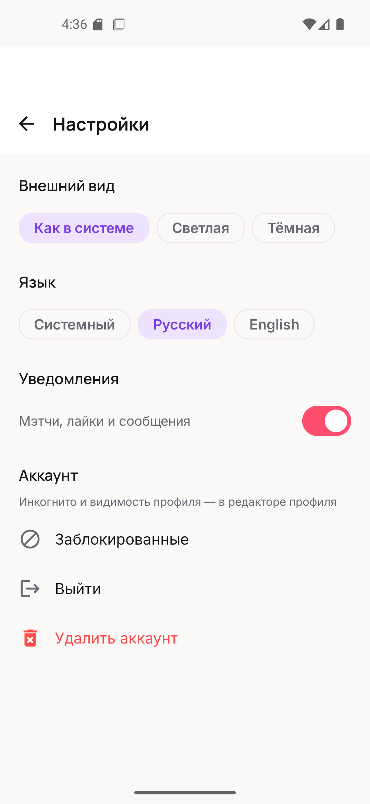
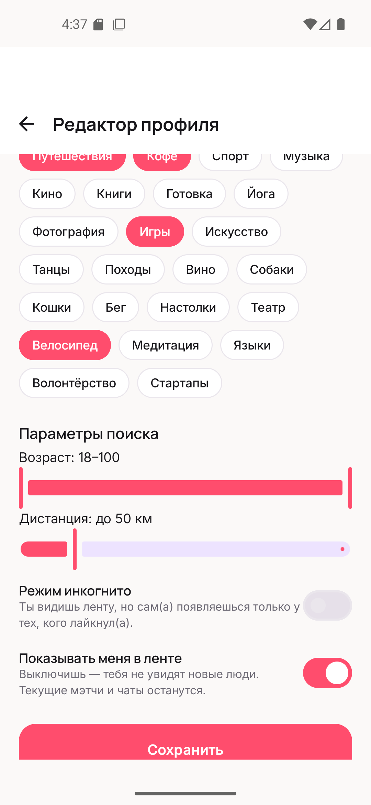
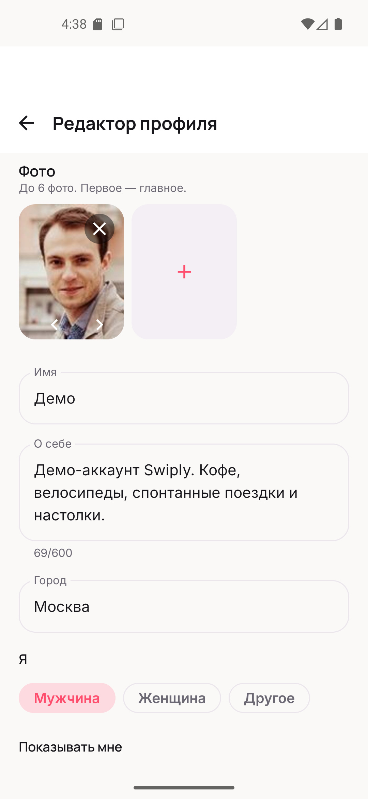
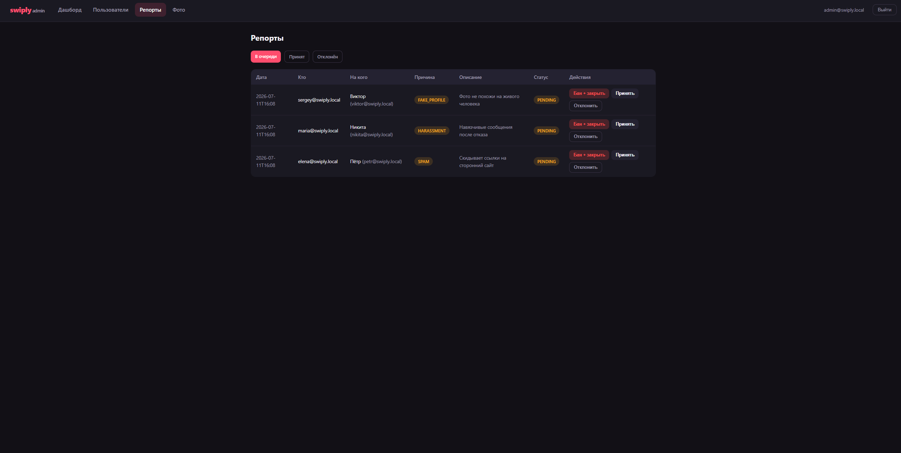
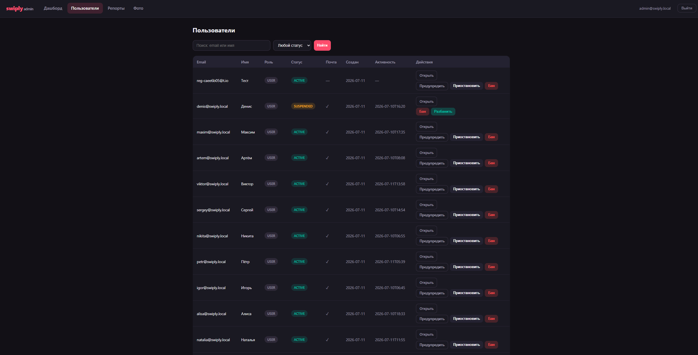

# Swiply

Пет-проект, Клон Tinder, на Kotlin. Android на Jetpack Compose и бэкенд на Spring Boot. Свайпы, мэтчи, чат в реальном времени, гео-подбор, модерация. заглушек нет, кроме отправки писем и пушей.

для портфолио. Разворачивается локально одной командой на docker-compose.

## Скриншоты

### Android

| | | |
|---|---|---|
|  Профиль |  Лента |  Свайп — мимо |
|  Свайп — лайк |  Мэтч |  Мэтчи и сообщения |
|  Настройки |  Редактор профиля — интересы |  Редактор профиля — фото |

### Админ-панель

| | |
|---|---|
|  Репорты |  Пользователи |

## Что внутри

Регистрация по почте с проверкой возраста, JWT с ротацией refresh-токенов, Argon2id для паролей. Профиль: до шести фото, био, интересы, настройки поиска.

Лента подбирает людей по геолокации через PostGIS фильтры по полу, возрасту и радиусу применяются с обеих сторон сразу. Карточки свайпаются с физикой, есть отмена последнего свайпа.

Мэтч создаётся синхронно на сервере, поэтому срабатывает, даже когда второй человек офлайн. Онлайн — уведомление летит по WebSocket сразу; офлайн — ждёт в inbox до следующего запуска. Есть экран кто тебя лайкнул и анимация при мэтче.

Чат  STOMP поверх WebSocket, история в MongoDB, набор текста, статусы доставлено/прочитано, presence через Redis, отправка фото. Сообщения уходят оптимистично и переотправляются после обрыва.

Модерация — жалобы, бан/приостановка/предупреждение, очередь фото, аудит-лог. Отдельная админ-панель на Thymeleaf. Контент сообщений и токены в логи не пишутся.

## Как устроено

```
Android (Compose)  ── REST + WebSocket ──►  Spring Boot (модульный монолит)
                                              │
        ┌─────────────────────────────────────┼───────────────────────────────┐
        ▼               ▼            ▼          ▼              ▼                 ▼
   PostgreSQL        MongoDB       Redis     RabbitMQ        MinIO           воркеры
   + PostGIS         (чаты)     (кэш ленты,  (media,        (фото)      (thumbnails,
   (истина)                      presence)    push, ...)                  пуши, ранжир.)
```

Бэкенд модульный монолит. Домены (`auth`, `profile`, `media`, `discovery`, `matching`, `chat`, `notification`, `moderation`, `admin`) разделены пакетами внутри одного модуля. Почему монолит, а не микросервисы расписано в разделе [Архитектурные решения](#архитектурные-решения-adr-лог) в конце этого файла.

Две базы работают вместе: Postgres держит всё, где нужны транзакции и геозапросы, MongoDB  только переписку, а гарантию для офлайна даёт inbox в Postgres. Реальный провайдер подключается заменой одного бина.

## Стек

Android — Compose, Material 3, MVVM, многомодульный Gradle (13 модулей), Coroutines/Flow, Hilt, Retrofit, свой STOMP-клиент на OkHttp, Room + Paging 3, DataStore, шифрованное хранилище токенов, FusedLocationProvider, Navigation Compose, кастомные Canvas-иллюстрации. Тесты — JUnit4, MockK, Turbine, Compose UI Test.

Бэкенд — Spring Boot 3, suspend-контроллеры, Spring Security с JWT, JPA, Spring Data MongoDB и Redis, Spring AMQP, WebSocket/STOMP, Thymeleaf, Flyway, springdoc-openapi. Тесты — JUnit 5, MockK, Testcontainers.

Инфраструктура  PostgreSQL 16 + PostGIS, MongoDB 7, Redis 7, RabbitMQ с DLQ, MinIO, Docker Compose, GitHub Actions.

## Запуск

Нужны Docker, JDK 21 и Android Studio (Narwhal / 2025.1 и новее — проект на AGP 9.0.1).

### Бэкенд

```bash
cd backend
cp .env.example .env
docker compose -f docker-compose.infra.yml up -d   # Postgres, Mongo, Redis, RabbitMQ, MinIO
./gradlew bootRun
```

Первый запуск долгий: качаются образы и зависимости. Готовность — строка `Started BackendApplicationKt` в логе или `UP` на <http://localhost:8080/actuator/health>.

Адреса, пока сервер работает:

| | Адрес | Логин |
|---|---|---|
| Swagger | <http://localhost:8080/swagger-ui.html> | |
| Админка | <http://localhost:8080/admin> | `admin@swiply.local` / `admin12345` |
| RabbitMQ | <http://localhost:15673> | `swiply` / `swiply-secret` |
| MinIO | <http://localhost:9101> | `swiply` / `swiply-secret` |

Порты инфраструктуры сдвинуты (Postgres 5433, Mongo 27018, Redis 6380, RabbitMQ 5673/15673, MinIO 9100/9101), чтобы не спорить с уже установленными на машине сервисами. Меняются в `.env`.

### Демо-данные

Чтобы приложение сразу было живым, запусти с сидом.

```powershell
# PowerShell
$env:SWIPLY_SEED_ENABLED="true"; ./gradlew bootRun
```
```bash
# bash / Git Bash
SWIPLY_SEED_ENABLED=true ./gradlew bootRun
```

Сид создаёт 20 профилей с настоящими портретами (тянет с randomuser.me, при отсутствии сети рисует заглушки), интересы, входящие лайки, мэтч с перепиской, а для админки — несколько жалоб в очереди и одного приостановленного пользователя. Сид идемпотентный: повторный запуск ничего не дублирует. Пересеять с нуля — `docker compose -f docker-compose.infra.yml down -v`, потом снова `up -d` и запуск с сидом.

Аккаунты:

- пользователь — `demo@swiply.local` / `demo12345`
- админ/модератор — `admin@swiply.local` / `admin12345`

### Android

Открой `android/` в Android Studio, дождись синхронизации, нажми Run. Адрес бэкенда уже прописан (`http://10.0.2.2:8080` — так эмулятор видит хост-машину), менять ничего не надо.

### Если не заводится

Здесь собраны грабли, на которые я реально наступил.

**Эмулятор пишет «нет соединения с сервером».** Скорее всего дело в сети эмулятора, а не в коде.

- Бэкенд запущен? `curl http://localhost:8080/actuator/health` с хоста должен вернуть `UP`.
- На хосте включён VPN или TUN-прокси (Radmin VPN, sing-box, happ)? TUN забирает весь трафик, эмулятор остаётся без маршрута, и `ping 10.0.2.2` внутри выдаёт `Network is unreachable`. Выключи туннель и сделай эмулятору **Cold Boot** (Device Manager → стрелка вниз → Cold Boot Now) — обычного перезапуска мало.
- Проверь маршрут: `adb shell ip route` должен содержать `default via 10.0.2.2`.

**Лента пустая и вечно грузит.** Эмулятор не знает своих координат. Задай их: Extended Controls → Location → Send, или командой:

```bash
adb emu geo fix 37.6176 55.7558   # долгота широта — центр Москвы, где стоят демо-профили
```

**Порт 8080 занят.** Где-то уже запущен бэкенд. Найди и сними процесс: `netstat -ano | findstr :8080`.

### На реальном телефоне

`10.0.2.2` работает только в эмуляторе. Для сборки под физическое устройство: телефон и компьютер в одной Wi-Fi-сети; в `android/core/core-network/build.gradle.kts` поменяй `API_BASE_URL` на IP компьютера (`http://192.168.1.50:8080`); запусти бэкенд с `MEDIA_PUBLIC_ENDPOINT=http://192.168.1.50:9100`, иначе фото не откроются (ссылки на них подписываются под адрес клиента); пересобери APK.

## Модерация

Панель — <http://localhost:8080/admin>, вход только для роли `ADMIN` или `MODERATOR`. Демо-сид сразу наполняет её: три жалобы в очереди и приостановленный пользователь (Денис) с записью в аудите — есть что потыкать.

Что можно делать: искать пользователей и открывать карточку с профилем, всеми фото (включая ждущие проверки), жалобами на человека и историей действий; предупреждать, приостанавливать, банить и разбанивать; разбирать очередь жалоб; одобрять и отклонять фото. Бан отключает человека сразу — refresh-токены отзываются, живые access-токены гасятся через Redis. Каждое действие пишется в неизменяемый аудит-лог.

Автопроверка фото подключается через интерфейс `ContentModerationChecker` (сейчас заглушка-автоаппрув). Содержимое переписки в логи не пишется, но модератор видит его через админку — приватность логов и разбор жалоб не мешают друг другу.

## Тесты

```bash
cd backend && ./gradlew test              # юнит + интеграционные на Testcontainers
cd android && ./gradlew testDebugUnitTest # ViewModel'и и STOMP-парсер
```

Интеграционные тесты поднимают настоящие PostGIS, Mongo, Redis, RabbitMQ и MinIO в контейнерах и гоняют полные сценарии: регистрацию с отсечкой по возрасту, мэтчинг для офлайн-получателя, гео-подбор, медиапайплайн до статуса APPROVED, чат по WebSocket с read receipts, матрицу 401/403, мгновенный бан. CI — [.github/workflows/ci.yml](.github/workflows/ci.yml).

## Хостинг

Всё в контейнерах, деплой сводится к конфигурации:

```bash
cd backend && docker compose up -d --build   # инфраструктура + бэкенд
```

В проде включается профиль `prod` (`SPRING_PROFILES_ACTIVE=prod`) — там нет ни одного дефолтного секрета, всё из окружения: свой `JWT_SECRET` (`openssl rand -base64 64`), пароли к базам, доступы к MinIO, публичный `MEDIA_PUBLIC_ENDPOINT` для ссылок на фото. Впереди ставится reverse-proxy с TLS. Дальше — любой VPS, Render, Railway или Fly.io.

## Тонкости

Мэтч для офлайн-собеседника. Проверка встречного лайка — серверная, в одной транзакции, с advisory-lock по паре пользователей. От онлайна второго человека не зависит. Дубликат при гонке двух встречных лайков ловит база: `UNIQUE` по нормализованной паре плюс блокировка. На это есть отдельный интеграционный тест.

Нормализация пары. Пары мэтчей хранятся упорядоченными (`user_a_id < user_b_id`), причём сравнение идёт по строке UUID, а не через `UUID.compareTo`. Java сравнивает UUID знаково, и её порядок расходится с порядком типа `uuid` в PostgreSQL, на котором держится `CHECK`-констрейнт. Расхождение всплывает не сразу.

Suspend-контроллеры и Spring Security. Suspend-функции в Spring MVC завершаются через ASYNC-dispatch, где `AuthorizationFilter` перепроверяет доступ, а JWT-фильтр уже не срабатывает — запросы падали в 401. Решение: `dispatcherTypeMatchers(DispatcherType.ASYNC).permitAll()`.

EXIF режется переэнкодом. Фото не чистится от метаданных, а полностью декодируется и собирается заново — GPS и остальной EXIF исчезают сами, а файл-полиглот с двойным дном пересборку не переживает. Формат проверяется по magic bytes.

Полный список решений — в разделе ниже.

---

# Архитектурные решения (ADR-лог)

Решения, принятые по ходу реализации там, где ТЗ оставляло свободу или содержало
неоднозначность. Формат: контекст → решение → почему.

## Backend

**D1. PostgreSQL + MongoDB вместе.** Из ТЗ: Postgres (+PostGIS) — источник истины
для всего транзакционного; MongoDB — только `conversations`/`messages`.

**D2. `geometry(Point,4326)` вместо `geography` в колонке.** Hibernate Spatial
валидирует geometry-тип без сюрпризов; метровая семантика достигается кастом
`::geography` в каждом гео-запросе (`ST_DWithin`, `ST_Distance`). Поведение
идентично, схема дружит с `ddl-auto: validate`.

**D3. EXIF-стрипинг через полный переэнкод.** Вместо вырезания EXIF-тегов
изображение декодируется и собирается заново (Thumbnailator → JPEG). Метаданные
(включая GPS) исчезают by construction, а «полиглоты» (файлы с двойным дном)
не переживают переэнкод. Принимаются только JPEG/PNG по magic bytes.

**D4. Suspend-контроллеры + блокирующие сервисы.** Spring MVC поддерживает
suspend-хендлеры; JPA остаётся блокирующим, поэтому паттерн:
`suspend fun` → `withContext(Dispatchers.IO) { транзакционный сервис }`.
`@Transactional` на suspend-функциях с JPA не работает — транзакции живут
только внутри блокирующего слоя.

**D5. ASYNC-dispatch разрешён в Spring Security.** Suspend-контроллеры завершаются
через ASYNC-dispatch, где `OncePerRequestFilter` (JWT) по умолчанию не выполняется →
`AuthorizationFilter` видел анонима и валил запрос 401-м. Решение из документации:
`dispatcherTypeMatchers(DispatcherType.ASYNC).permitAll()` — аутентификация уже
проверена на исходном REQUEST-dispatch.

**D6. Установка SecurityContext — только через `createEmptyContext()` + `setContext()`.**
Мутация deferred-контекста (`getContext().authentication = …`) в Spring Security 6
теряется.

**D7. Нормализация пары мэтча — лексикографически по `uuid.toString()`.**
`UUID.compareTo` в Java сравнивает знаково и НЕ совпадает с порядком `uuid` в
PostgreSQL; строковое сравнение hex-представления совпадает с байтовым порядком БД,
на котором держится CHECK-констрейнт `user_a_id < user_b_id`.

**D8. Advisory-lock пары при свайпе.** `pg_advisory_xact_lock(hashtextextended(a:b))`
сериализует встречные лайки — дубль мэтча невозможен даже при гонке.

**D9. Unmatch окончателен.** После разрыва пара не может смэтчиться заново
(unique-констрейнт пары + идемпотентный свайп). Это осознанная продуктовая
семантика, как в большинстве дейтинг-приложений.

**D10. Диалог создаётся лениво.** Не при мэтче, а при первом входе в чат
(`POST /conversations/by-match/{matchId}`, get-or-create). Убирает связь
matching → chat и лишние пустые документы.

**D11. Подтверждение почты — флаг, не гейт.** Регистрация сразу выдаёт токены
(auto-login), `email_verified` отображается в профиле. Реальный SMTP — за
интерфейсом `EmailSender` (дефолт пишет токены в лог). Гейт добавляется одним
`@PreAuthorize`, если понадобится.

**D12. Кандидаты без фото показываются в ленте.** Требование «минимум 1 фото»
убило бы демо на двух свежих аккаунтах. Плейсхолдер — градиент с инициалом.

**D13. Push без Firebase.** Базовая доставка: WebSocket (онлайн) + персистентный
inbox `notifications` (офлайн, подтягивается при старте). `PushNotificationSender` —
no-op-логгер за интерфейсом; FCM/UnifiedPush подключаются заменой бина. Отправка
идёт через очередь `push.send` (RabbitMQ) — бизнес-транзакция не ждёт провайдера.

**D14. Город — обратный геокодинг на устройстве.** Android Geocoder определяет
город локально и шлёт строкой; сервер ничего не геокодит и не ходит во внешние
сервисы. Точные координаты не покидают backend (другим отдаётся округлённое
`ST_Distance`).

**D15. Порты локальной инфраструктуры сдвинуты** (PG 5433, Mongo 27018,
Redis 6380, Rabbit 5673/15673, MinIO 9100/9101), чтобы не конфликтовать с уже
установленными сервисами. Всё конфигурируется через `.env`.

**D16. Presigned-ссылки подписываются под публичный endpoint.** Подпись S3 включает
хост, поэтому для эмулятора ссылки подписываются под `http://10.0.2.2:9100`
(конфиг `MEDIA_PUBLIC_ENDPOINT`). Внутренние операции идут по внутреннему адресу.

**D17. Админка — server-side Thymeleaf** поверх тех же сервисов, что и REST admin
API (RBAC `ADMIN`/`MODERATOR`, отдельная security-цепочка с form-login и сессиями).
Ни строчки JS-фреймворков; будущий SPA сядет на готовый REST.

**D18. Ban действует мгновенно.** Смена статуса + отзыв всех refresh-токенов +
Redis-флаг `auth:blocked-user:{id}` с TTL = времени жизни access-токена: живые
JWT гаснут без запроса в Postgres на каждый вызов.

## Android

**D19. AGP 9.0.1 + Gradle 9.4.1 + Kotlin 2.3.21 + KSP 2.3.10, compileSdk 36.**
AGP выровнен с установленной Android Studio (она поддерживает максимум 9.0.x).
Самые свежие AndroidX-артефакты (core-ktx 1.19, lifecycle 2.11, androidx.hilt 1.4)
требуют compileSdk 37 / AGP 9.1+ — взяты их предыдущие стабильные версии
(1.18.0 / 2.10.0 / 1.3.0). Для классического KGP при AGP 9 обязательны флаги
`android.builtInKotlin=false` и `android.newDsl=false`.

**D20. Многомодульность без convention-плагинов.** 13 модулей (app + 6 core +
7 feature) с прямыми build-файлами. Convention-плагины добавили бы buildSrc-слой —
ценность не окупает риск на свежем AGP 9.

**D21. Один стек сериализации — kotlinx.serialization.** DTO, retrofit-конвертер
и type-safe маршруты Navigation Compose используют одну библиотеку; ни KAPT,
ни Moshi/Gson.

**D22. Токены — EncryptedSharedPreferences (Keystore), настройки — DataStore.**
Требование ТЗ §10/12. Room чистится при логауте.

**D23. Свой минимальный STOMP-клиент поверх OkHttp WebSocket (~150 строк).**
CONNECT/SUBSCRIBE/SEND/MESSAGE — всё, что нужно чату; без сторонних STOMP-библиотек.
JWT уходит query-параметром (нативный WS-клиент не пробрасывает заголовки),
сервер валидирует его до апгрейда.

**D24. Optimistic-отправка сообщений.** Локальная запись `isPending` в Room →
WS-отправка с `clientTempId` → echo сервера заменяет временную запись. При
reconnect pending-сообщения ресендятся, история дотягивается по REST
(WebSocket — только «живая» доставка, не источник истины).

**D25. Экран «Мэтчи» читает диалоги из общего Room-кэша.** Синкает их feature-chat;
feature-match не зависит от feature-chat — граница проходит через core-database.

**D26. JUnit4 + MockK + Turbine для unit-тестов** (вместо JUnit5 из ТЗ):
JUnit5 на Android требует сторонний Gradle-плагин, совместимость которого с AGP 9
не подтверждена. Compose UI-тесты — в `androidTest` (локально, на эмуляторе);
CI гоняет JVM-тесты и сборку APK.

**D27. Локаль по умолчанию — русская**, `values-en` — английская. Переключение
RU/EN/System через per-app locales (`AppCompatDelegate.setApplicationLocales`),
поэтому единственная Activity — AppCompatActivity.

**D28. Переключатели приватности (инкогнито/видимость) живут в редакторе профиля**,
а не в настройках: это параметры поиска, им место рядом с дистанцией и возрастом.
В настройках — тема, язык, уведомления, блок-лист, логаут, удаление аккаунта.